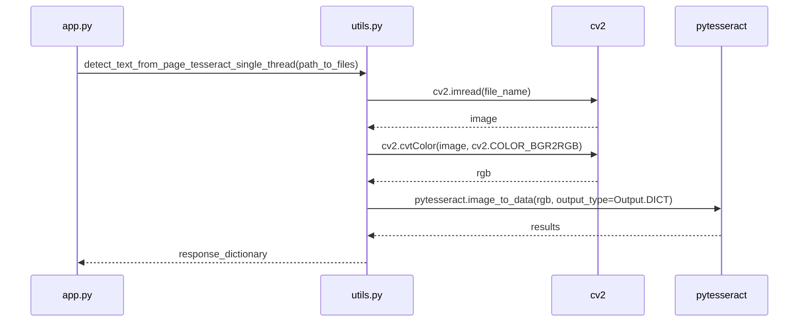
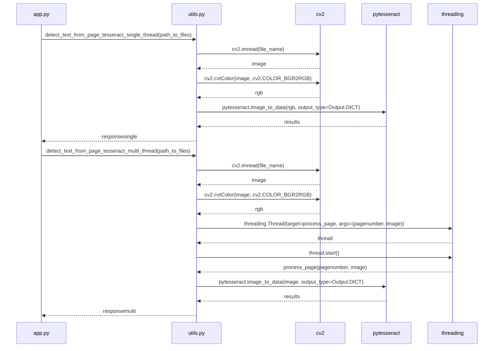
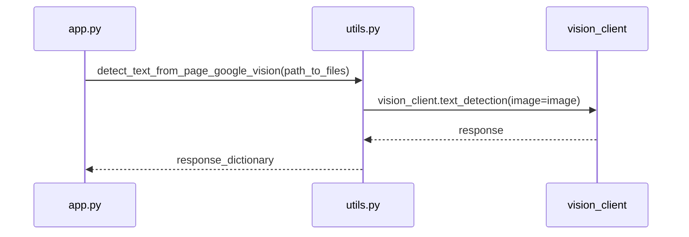

# OCR using Teserract and Google Vision

This repo consist of two branches:

- Production
- Local

Production contains the code that is hosted on EC2 with a frontend, while the local branch contains the Dockerized code that can be spun up in a container using just a few steps shown in "steps to follow" below.

# Folder structure

The current folder follows a structured organization that promotes clarity and ease of navigation. Here's an explanation of the folder structure:

1.  **app.py**: This file contains the main application code. It serves as the entry point and orchestrates the execution of different tasks based on user input.
2.  **utils.py**: This module provides utility functions used by the application. It includes functions for converting PDF pages to images, performing text extraction using Tesseract OCR and Google Vision API, and generating informative tables for displaying results.
3.  **output/**: This directory stores the output files generated by the application. It typically contains the converted images from PDF files or any other intermediate or final output files.
4.  **auth.json**: This file holds the credentials required to authenticate and access the Google Vision API. It is used by the application to authenticate with Google Cloud services.
5.  **requirements.txt**: This file lists the dependencies required by the application. It includes external libraries like pytesseract, cv2, google-cloud-vision, pypdfium2, and others. These dependencies can be installed using the `pip install -r requirements.txt` command.

The folder structure follows a modular approach, separating the main application logic in `app.py` from utility functions in `utils.py`. This separation enhances code organization and maintainability. The output folder provides a dedicated location for storing generated files, ensuring a clean and organized workspace.

Overall, the folder structure is designed to promote code modularity, ease of development, and effective management of generated output files.

```
.
├── 12100010_f1.pdf
├── Dockerfile
├── app.py
├── auth.json
├── output
├── readme.md
├── requirements.txt
└── utils.py

2 directories, 15 files
```

# Steps to follow

## Deployed

[Click here](https://ocr-frontend-im1l.onrender.com)

## Responses

- ### Route: `/gcp_vision`

  **Description:** This route is used to upload a PDF file, convert each page of the PDF to images, and then extract text from these images using Google Cloud Vision API.

  **Method:** POST

  **Parameters:**

  - `file` (UploadFile): The PDF file to be uploaded.

  **Response Model:**

  - `pages` (list): A list of dictionaries, each containing the page number and the extracted text from that page.
  - `total_time` (float): The total time taken for text extraction from all pages.

  **Example Request:**

      POST /gcp_vision
      Content-Type: multipart/form-data

      file=<path_to_pdf_file>

  **Example Response:**

      {
          "pages": [
              {
                  "page_number": 1,
                  "text": "Text from page 1..."
              },
              {
                  "page_number": 2,
                  "text": "Text from page 2..."
              },
              ...
          ],
          "total_time": 2.345
      }

- ### Route: `/tesseract_single`

  **Description:** This route is used to upload a PDF file, convert each page of the PDF to images, and then extract text from these images using Tesseract OCR in a single thread.

  **Method:** POST

  **Parameters:**

  - `file` (UploadFile): The PDF file to be uploaded.

  **Response Model:**

  - `pages` (list): A list of dictionaries, each containing the page number and the extracted text from that page.

  **Example Request:**

      POST /tesseract_single
      Content-Type: multipart/form-data

      file=<path_to_pdf_file>

  **Example Response:**

      {
          "pages": [
              {
                  "page_number": 1,
                  "text": "Text from page 1..."
              },
              {
                  "page_number": 2,
                  "text": "Text from page 2..."
              },
              ...
          ]
      }

- ### Route: `/tesseract_multi`

  **Description:** This route is used to upload a PDF file, convert each page of the PDF to images, and then extract text from these images using Tesseract OCR in multiple threads for parallel processing.

  **Method:** POST

  **Parameters:**

  - `file` (UploadFile): The PDF file to be uploaded.

  **Response Model:**

  - `single_thread_time` (float): The time taken for text extraction using Tesseract in a single thread.
  - `multi_thread_time` (float): The time taken for text extraction using Tesseract in multiple threads.
  - `page_text` (list): A list of extracted texts from each page.

  **Example Request:**

      POST /tesseract_multi
      Content-Type: multipart/form-data

      file=<path_to_pdf_file>`

  **Example Response:**

      {
          "single_thread_time": 5.678,
          "multi_thread_time": 3.123,
          "page_text": [
              "Text from page 1...",
              "Text from page 2...",
              ...
          ]
      }

## Docker

1.  Clone the repo using following command :
    `git clone -b local https://github.com/kushthakker/ocr-backend.git`
2.  Switch to repo's directory `cd ocr-backend`
3.  Start the docker on your system
4.  `docker build -t ocr .`
5.  `docker run -i -rm -p 4000:4000 --name container_ocr ocr`
6.  The application will start running and display the following message:

```
select type of task you want to run:
 1) Local Tesseract
 2) Google Vision
```

7. Enter `1` or `2` based on the task you want to perform:

   - Enter `1` for local Tesseract OCR.
   - Enter `2` for Google Vision API.

8. If you selected the local Tesseract OCR option (`1`), the application will present the following message:

   ```
   1) Single Thread
   2) Single Thread + Multithread (Compare)
   ```

9. Enter `1` or `2` based on the sub-task you want to perform:

   - Enter `1` for single-threaded text extraction.
   - Enter `2` for single-threaded + multi-threaded comparison.

10. The application will start executing the selected task(s) on the PDF file(s) in the `output/` folder.

11. Depending on the selected task(s), the application will display the results in the console. These results may include extracted text, processing times, and comparison tables.

## Manual

To run the application and execute the desired tasks, follow these steps:

1. Ensure that you have all the necessary dependencies installed. You can install them by running the following command in the terminal:

   ```
   pip install -r requirements.txt
   ```

2. Open the terminal and navigate to the project directory.

3. Execute the following command to run the application:

   ```
   python app.py
   ```

4. The application will start running and display the following message:

   ```
   select type of task you want to run:
    1) Local Tesseract
    2) Google Vision
   ```

5. Enter `1` or `2` based on the task you want to perform:

   - Enter `1` for local Tesseract OCR.
   - Enter `2` for Google Vision API.

6. If you selected the local Tesseract OCR option (`1`), the application will present the following message:

   ```
   1) Single Thread
   2) Single Thread + Multithread (Compare)
   ```

7. Enter `1` or `2` based on the sub-task you want to perform:

   - Enter `1` for single-threaded text extraction.
   - Enter `2` for single-threaded + multi-threaded comparison.

8. The application will start executing the selected task(s) on the PDF file(s) in the `output/` folder.

9. Depending on the selected task(s), the application will display the results in the console. These results may include extracted text, processing times, and comparison tables.

10. Review the output and analyze the results based on your requirements.

By following these steps, you can easily run the application, select the desired task(s), and process your PDF files using Tesseract OCR or the Google Vision API. Make sure to provide the correct input and carefully review the output to gain valuable insights from the text extraction process.

## UML diagrams

### Sequence Diagram (Local Tesseract - Single Thread):



### Sequence Diagram (Local Tesseract - Single Thread + Multithread):



### ### Sequence Diagram (Google Vision):



## Output

### Start Input


### Single Thread


### Multi Thread


### Google Vision


### Frontend

